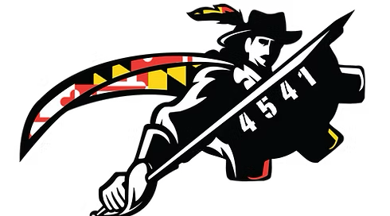

# RobotCode 2025

This repository contains Team 4541's robot code for the First Robotics Competition Challenge Reefscape.

    

## Major Updates from 2024

Our 2024 robot (Tempo)'s code is available to the public [here!](https://github.com/cavineers/RobotCode2024)

### Implemented:

- Advantage Kit Logging
- Advantage Scope + Simulation (for testing)
- Autonomous Path Generation (for teleop)
- Reworked swerve drive
- Better organization overall

## Contributors

